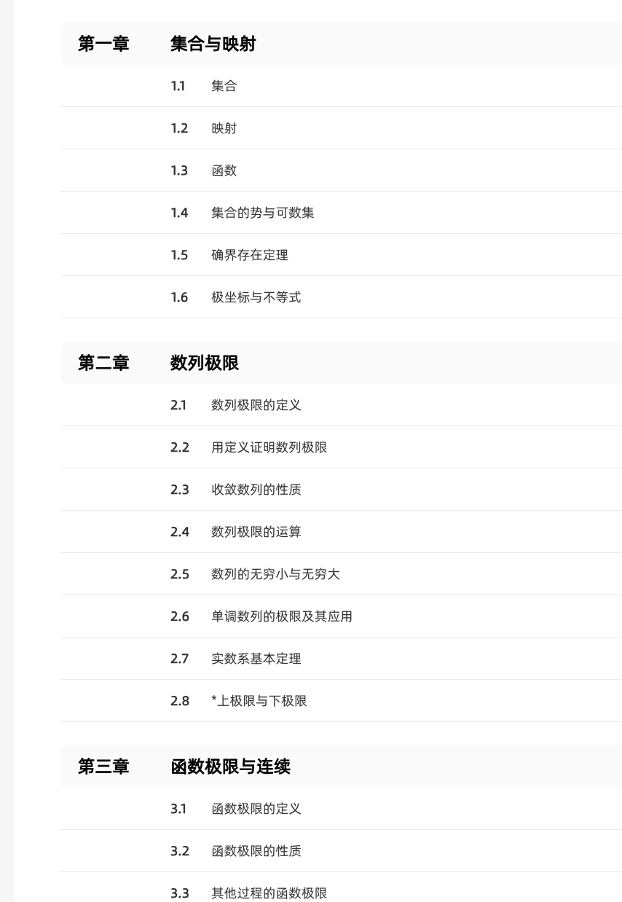
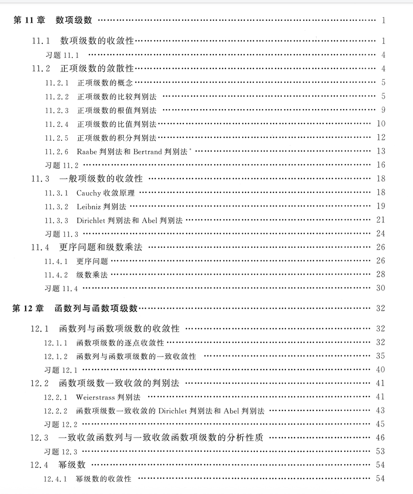
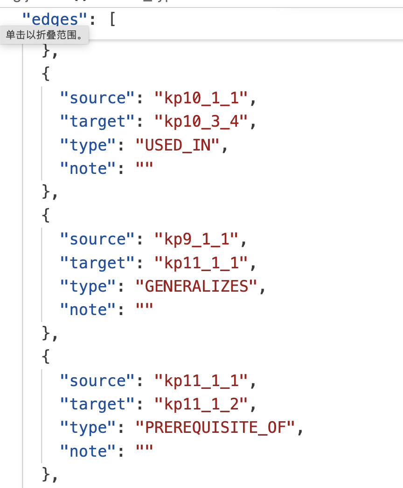
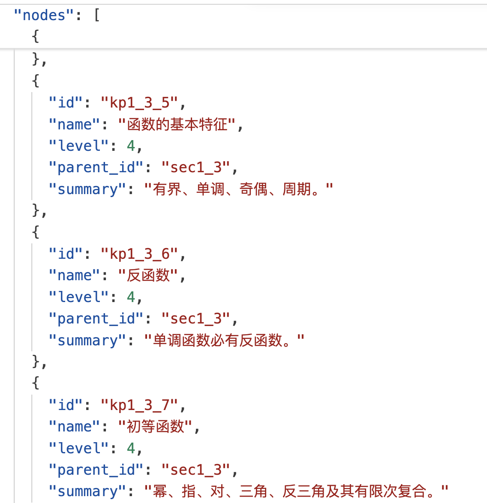
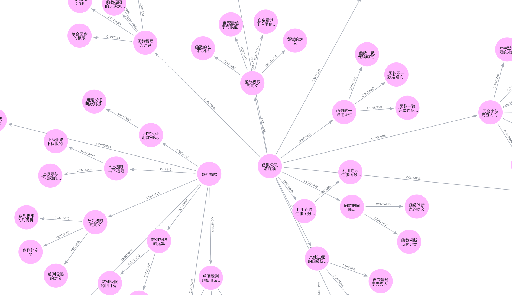
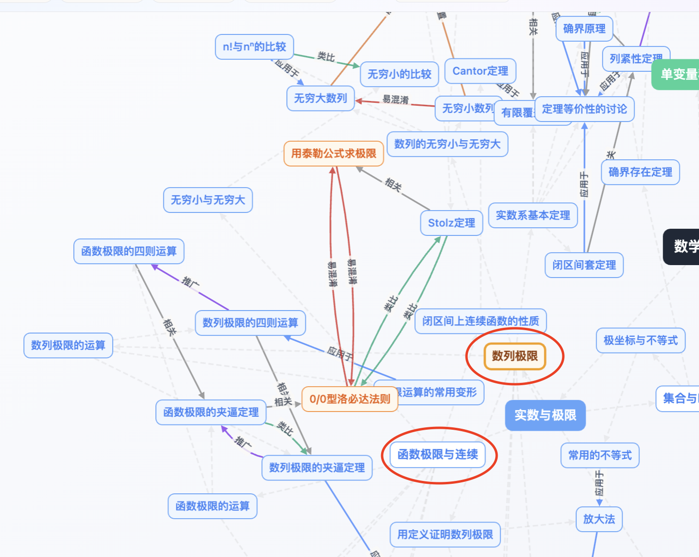

# 基于增强知识图谱的数学学习路径规划与错题分析系统

## **一、项目介绍**

我们基于北航《工科数学分析》(上/下册)课程知识结构构建了一个本地可运行的知识图谱浏览器，并在增强图谱的基础上实现了两个下游应用：

1. 基于图谱关系的学习路径推荐。

2. 基于本地 Ollama 大模型的错题考点分析。

**不调用云端大模型 API，核心数据、图谱可视化和 LLM 推理都可以在本地完成。**

## **二、知识抽取**

### **1.原始知识图谱的构建**

数据来源: 工科数学分析 上/下





左图来源: https://coursehomenew\.zhihuishu\.com/courseHome/curriculum?courseId=1100000059\&recruitId=419919\&termId=25)

右图来源: 工科数学分析(下)目录页

<!-- 上面这两张图, 在 PPT 中并排展示 -->

我们将目录和知识点信息提取了出来, 以json 的形式存储， 如下图所示

- 每个节点: 名称\+编号\+层次结构\+简要描述

- 每条边: 头结点\+尾节点





### **2. 知识图谱增强**

原始课程知识是树状结构：

```Plain Text
→ 章节
→ 小节
→ 知识点
```

这种结构能表达“包含关系”，但很难落地于下游应用\. 具体来说, 难以回答如下问题：

- 学某个知识点之前应该先补什么？

- 一个知识点会被用于哪些题型？

- 一道错题到底考察了哪些知识点？

- 大模型回答时到底有没有依据图谱，而不是靠自己编？


#### 我们的目标? 

原始树状知识结构扩展成更像“**知识网络**”的形式，并基于它做**可解释**的下游应用。


#### 我们做了什么?

- 重新整合知识结构

    - 增强前: 按照上下册章节关系罗列知识点, 缺少知识点之间的关联

    - 增强后: 整合为六大主题: 实数与极限 单变量微分学 单变量积分学 多变量微分学 多变量积分学 级数与微分方程, 知识点之间的排布更加合理

- 增加关系类型, 扩展关系对数量:

    这里需要想一下, 如果老师问增强是怎么做的, 总不能说 AI吧?

    - 增强前: 只有一种包含关系, 而且仅限不同层次的节点之间\. **327 个关系对**

    - 增强后: 引入多种类型的关系, 丰富知识图谱的语义结构 **634个关系对**

|关系|含义|用途|
|---|---|---|
|`PREREQUISITE_OF`|A 是 B 的前置知识|学习路径规划|
|`USED_IN`|A 会用于 B|题型/应用分析|
|`GENERALIZES`|A 是 B 的推广|概念层次理解|
|`SPECIAL_CASE_OF`|A 是 B 的特例|特例与一般理论联系|
|`SIMILAR_TO`|A 与 B 类似|类比学习|
|`EASILY_CONFUSED_WITH`|A 与 B 容易混淆|错因诊断|
|`RELATED_TO`|A 与 B 相关|弱关联补充|

- 增强了知识图谱的表示效果\(色彩\)

#### 知识图谱增强前后的对比

- 增强前:  章节之间知识点缺乏联系, "数列极限"和"函数极限"之间完全没有联系



- 增强后:  章节之间联系增强, "数列极限"和"函数极限"形成**紧密联系**, e\.g\. **Stolz 与洛必达法则**



<!-- 这两个图, 可以分两页展示 -->


*下面这个文本块不需要写到 PPT 里面, 是展示的一个思路而已*
```txt
这里首先应该展示一下咱们的知识图谱前端:
图谱浏览器支持：
左侧树状目录浏览;
顶部知识点搜索;
中间局部知识图谱可视化;
边关系中文显示。
按关系类型筛选。
调整邻域跳数。
右侧知识点详情。
右侧关系分组查看。
```


## 三、下游任务一: 基于图谱关系的学习路径推荐助手
### 1. 设计思路

学习路径助手不调用 LLM，而是完全基于图谱关系做确定性分析。

选择一个知识点后，系统会自动分析(以当前节点为头结点, 查找对应的边和尾节点)：

- 先补基础
- 推荐路径
- 应用方向
- 易混淆 / 类比提醒

```Plain Text
具体来说, 对于一个知识点 B：

沿 PREREQUISITE_OF 反向找前置知识
沿 USED_IN 正向找应用场景
沿 EASILY_CONFUSED_WITH / SIMILAR_TO 找易混淆和类比概念
```

### **展示价值**

这部分体现了知识图谱本身的价值：

- 可解释性 / 结果稳定:每条建议都能追溯到具体关系

- 不依赖大模型


<!-- 留白一页, 进行展示 -->

## **四、下游任务二: 错题分析 AI**

### **为什么要做错题分析**

普通大模型可以直接回答数学题，但有两个问题：

- 它可能只是靠预训练知识回答。

- 它的回答不一定对应我们课程知识图谱中的节点。

所以我们没有让大模型自由发挥，而是让它完成一个更受约束的任务：

**题目文本 → 知识图谱节点映射, 让大模型的错题分析结果可解释、可追溯、可视化。**

也就是说，它要判断一道题考察了图谱中的哪些知识点。

### **错题分析流程**

```Plain Text
用户粘贴题目
↓
后端读取知识图谱(json 文件形式存储)
↓
用节点名称、summary、层级路径、关系 note 做轻量文本召回
↓
得到 top-k 候选知识点
↓
把候选节点 ID 列表交给本地 Ollama 模型
↓
要求模型只能从候选 ID 中选择考点并输出 JSON
↓
后端再次校验 ID，过滤模型编造的节点
↓
前端展示考点权重、条件检查、解题步骤、常见错误和图谱依据
↓
图谱中高亮相关节点和边
```

这里可以画一张流程图, 就像顶会那种圈圈框框的


### **技术细节**

- **候选知识点是怎么查出来的?**

简单来说, 就是(下面两句话写到 PPT 里):

1. 通过正则和同义词扩展提取题干特征 $\rightarrow$ 与图谱节点的名称/关系/描述进行字面/规则匹配 $\rightarrow$ 算出初始的文本匹配得分

2. 选出得分最高的前 8 个节点及其“一跳邻居", 依照分数, 输出的 Top\-K 个节点.(为了让大模型能够挑选出那些在字面上没有匹配中，但在前置/应用逻辑上高度相关的节点)

3. 于是得到了 Top-K 个候选节点

下面的代码块, 是 AI 给出的具体解释. 可以不放在 PPT 中

```Plain Text
第一步：用户问题的预处理与“查询扩展” (Query Expansion)
  系统拿到用户粘贴的题目后，首先会通过   tokens()   函数进行深度的解析：
**提取词元**：利用正则提取出所有的英文单词、数字、中文单字，以及特定的数学函数（如 sin, cos, ln, exp）。
**生成 N-gram**：对中文文本进行滑动窗口切分，生成长度为 2 到 4 的词组（N-grams），增加匹配的颗粒度。
**同义词/关联词扩展（核心亮点）**：代码中内置了一个 hints 字典。如果题目中出现了“极限”，算法会自动把“趋于”、
“收敛”、“无穷小”等关联词加入到搜索词元中；如果出现“导数”，则会自动补充“可导”、“微分”等。
这使得题目即使没有直接使用官方术语，也能命中相关考点。


第二步：知识节点的“文档化” (Document Construction)
  为了进行比对，算法通过   node_text()   函数将知识图谱中的每一个节点转化成了一段富文本。这段文本融合了多个维度的信息：
**节点名称 (Name), 节点摘要 (Summary)**
**层级路径 (Breadcrumb)**：例如“微积分 / 一元函数 / 导数”，这保留了该节点的宏观位置信息。
**图谱关系备注 (Edge Notes)**：提取了与该节点相连的最多 12 条边的 note 字段。
这就把原本在边上的知识（比如“应用于”、“前置于”）融入到了节点本身的特征中。


第三步：多维度的启发式打分打分 (Heuristic Scoring)
  接下来，算法将预处理后的题目特征与每一个“节点文档”进行交叉比对，并使用一套精细的加权规则计算初始得分：
**绝对命中奖励**：如果题干中完整包含了节点名称，直接加高分（长度 $$\ge 3$$ 加 28 分，否则加 8 分）。
**Token 覆盖得分**：比对题目词元和节点词元的交集，
              根据命中的词汇长度给予 0.35 到 3.6 不等的加分（长词往往是更核心的专业术语，得分更高）。
**高频数学核心词共现**：如果“连续”、“可导”、“泰勒”等核心词同时在题目和节点中出现，额外加 5 分。
**典型题型“硬编码”探测**：算法会正则探测题目是否属于“特殊点求导”（如 x=0 处导数）或“震荡极限”（如 sin(1/x)）。
一旦发现，直接给特定的节点 ID（如 kp4_1_1）加上极高的静态分数。
**层级深度惩罚与奖励**：为了避免大模型总是选那些太宽泛的大章标题，算法会对叶子节点（level >= 3）的分数乘以 1.12 的奖励，
                 而对根节点（level <= 1）的分数乘以 0.55 进行惩罚。
                 
                 
第四步：基于图结构的“邻域扩散” (Graph Neighborhood Expansion)
**  这是该算法中最有区分度的一步，也是体现“图谱”价值的地方。**
  在通过文本匹配得到初步的降序得分列表后，算法截取了得分最高的前 8 个节点。接着，它在知识图谱中去寻找这 8 个节点的“一跳邻居（1-hop neighbors）”（无论是 incoming 还是 outgoing 边）。
  这些邻居节点即使在前面文本匹配时得分为 0，此时也会被赋予 **  父节点得分的 42% (  score * 0.42  )**   并加入候选池。
    **学术意义**：这就是经典的图谱推理扩散（Graph Spreading）。它解决了词汇不匹配的问题，使得大模型在后续判断时，能够顺藤摸瓜看到前置知识和应用场景，真正发挥了图谱的拓扑优势。
```

- **大模型如何被约束?**

    后端不会直接相信模型输出。

    模型只能看到候选节点列表，例如：

    ```JSON
    [
      {"id": "kp4_1_1", "name": "导数的定义"},
      {"id": "kp4_3_1", "name": "由定义求导举例"}
    ]
    ```

    模型必须输出这些候选节点中的 ID。

    后端会再次检查：

    ```Plain Text
    如果模型输出了不存在的 id → 丢弃
    如果输出格式不是 JSON → 降级为本地匹配结果
    ```

    因此系统不是让大模型随便编，而是让大模型在图谱候选范围内做判断。

    - **具体是通过什么实现的约束? \-\-Prompt**

<!-- 下面的代码块是具体的原理, 可以从中简要写一部分, 加到 PPT中 -->

```Plain Text
**在 code/problem_analyzer_server.py 中，定义了一个核心变量 PROMPT_TEMPLATE。**
**这个 Prompt 就是整个 AI Agent 的“大脑指令”，它做了三件极其重要的事情：
****设定角色与底线：开篇第一句“你是一个受知识图谱约束的数学错题分析助手……你只能选择候选列表里已有的 id，**
             **不能编造新节点”。这明确告诉大模型：别自由发挥，必须从我给你的库里挑。
****输入上下文（开卷）：它把用户的 {question} 和我们刚才讲到的经过轻量文本召回算出来的 {candidates}（Top-K 候选节点的 JSON）一起塞给了大模型。**
                **大模型看着这些精准的候选资料，就能“照本宣科”地分析。
****强制格式化输出（JSON Schema 约束）：Prompt 中写死了一个 JSON 的模板，**
                                **要求大模型必须输出包含 condition_check、diagnosis、nodes、route、solution_steps、mistakes 这几个 Key 的 JSON 格式。 **
                                
                                
大模型吐出了结构化的 JSON，后端拿到后就会进行“拆包、校验和加工”，最终送给前端展示。这些内容分为两类生成方式：
第一类：大模型（LLM）基于题目和候选节点直接生成的
**解题步骤 (**solution_steps**) & 常见错误 (**mistakes**)**：这是大模型利用自身的数学逻辑推理能力，结合题目分析写出来的。后端只是简单提取了前 8 条。
**条件检查 (**condition_check**)**：Prompt 里专门嘱咐了大模型“如果题目条件可能不完整，要在 condition_check 中指出”。
**考点权重 (**weight**)**：大模型会在 nodes 列表中为选中的每个考点打一个 1-100 的权重分。为了防止大模型数学不好导致权重加起来不等于 100，后端代码里专门写了一个 normalize_weights 函数。这个函数会把这些分数重新按比例压缩/放大，并把零头补到第一个考点上，确保它们加起来绝对等于 100。

第二类：后端（Python）基于大模型的选择，在图谱中反查出来的
这一步是防幻觉的**终极绝杀**，也是极其出彩的工程设计。
**图谱依据 (**graph_evidence**)**：这个**绝对不是大模型生成的**。
大模型在 JSON 里输出了它认为相关的节点 ID（存放在 nodes 和 route 列表里）。
后端代码把这些 ID 收集起来，交给一个叫 graph_evidence 的函数。
这个函数会回到最原始的 kg.json 里，去查找：**被大模型选中的这些 ID 之间，在知识图谱里原本有没有连线（edges）？**
如果有连线，就把这条连线的起点、终点、关系类型（比如把 PREREQUISITE_OF 翻译成“前置”）以及备注信息提取出来。
这就构成了前端展示的“图谱依据”。它向用户证明了：大模型的分析不是瞎猜的，而是图谱底层确实有这样的逻辑关系支撑。
```

### **效果展示(展示的时候, 断网, 并且 nvtop 或者 activity 面板展示 GPU 利用率)**

<!-- 这一部分不需要做 PPT, 留出一页空白, 直接用 UI 展示 -->

示例题目: 

```Plain Text
求函数 f(x)=x^2 sin(1/x) 在 x=0 处的导数
```

系统可能识别出：

- 导数的定义

- 由定义求导

- 单侧导数

- 函数极限

- 夹逼定理 / 有界性估计

它还会提醒：

```Plain Text
如果题目没有定义 f(0)，需要先检查函数在 x=0 处是否有定义。
```

- 普通求解关注答案。

- 错题分析关注考点、前置知识和易错原因。


## **五、总结: 项目亮点，局限与改进方向**

### **项目亮点**

- 知识图谱不只是展示, 还有下游应用:

学习路径推荐、错题考点识别、大模型回答约束、图谱依据展示。

- 大模型不是自由发挥

    - LLM 负责理解题面和组织解释

    - KG 负责约束考点范围和提供依据

    这能减少幻觉，也让结果更容易解释。

- 本地可运行

所有关键部分都可以在本机运行：

图谱数据、前端依赖、Python 后端、Ollama 模型

### 限制

- 文本召回没有使用 embedding，因此对非常隐晦的题面可能召回不够准。

- 错题分析依赖本地模型能力，模型较小时可能需要更强 prompt 约束。

- 图谱关系质量，仍然会影响学习路径和错题分析质量。

- 目前没有自动批量评测错题分析准确率。

### 后续可以改进：

- 加入 BGE 等本地 embedding 检索。

- 增加人工标注 gold set 做准确率评估。

- 加入更多典型题库。

- 让错题分析结果生成个性化复习计划。

- 对不同模型做效果对比。


# 以下作为参考资料，部分为AI给出的内容，可以作为做 PPT的参考  不放到PPT中

## 可能被拷打的问题：

1. 你们是怎么做知识图谱增强的？

2. 本地大模型推理的意义？

3. 学习路径助手和大模型错题分析，二者在功能上的差异？

4. 大模型推理一般会使用 embedding\+ ToG, 为什么你们没用?

    一个可行的回答: *当前节点规模不大, 且模型参数量亦不大, 可以直接查找节点, 而无需做embedding *

    这个回答有待细化\. 而且还可以查一下 BGE embedding到底是什么:

    BGE: 北京智源研究院（BAAI）开源的高性能文本向量模型，主打检索与语义匹配，在中文与多语言任务上长期领先，广泛用于 RAG、搜索、推荐等场景


## 技术架构

```Plain Text
data/kg.json
    ↓
viewer/app.js + Cytoscape.js
    ↓
本地知识图谱浏览器

错题文本
    ↓
Python 后端 problem_analyzer_server.py
    ↓
轻量文本召回候选知识点
    ↓
Ollama 本地模型 qwen2.5:7b
    ↓
受约束 JSON 输出
    ↓
后端校验节点 ID
    ↓
前端展示 + 图谱高亮
```

